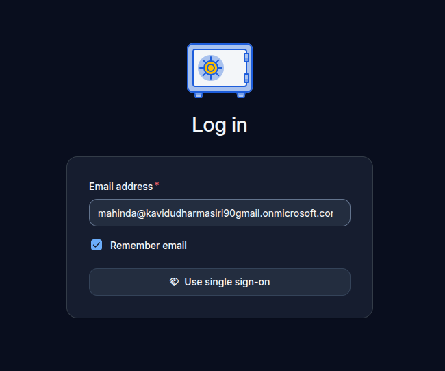

# Self hosted Password managers

- passbolt
  Azure AD support but need paid version

- Vaultwarden
  Support Azure AD free

- Bitwarden
  Azure AD SSO is not free

# Vaultwarden

- can disable user signup, so only invited users can create account
- when we add sso from azure ad, even when the user gets invited he needed to be in the azure ad

- when a user have a account he can have his own passwords save in his vault
- we can create vaultwarden as auto complete password manager in the browser
- we can create a account for the company can save those password in a organization and add people to the collections in the organization
- can send password, and files with link
  - data only available for given count and hours
  - also limit for specific users

## Things to check

- how backup words (db)
- encryption type
- admin panel

## Vaultwarden sso setup

https://github.com/dani-garcia/vaultwarden/wiki/Enabling-SSO-support-using-OpenId-Connect

## Vaultwarden image envs

https://github.com/dani-garcia/vaultwarden/blob/main/.env.template
